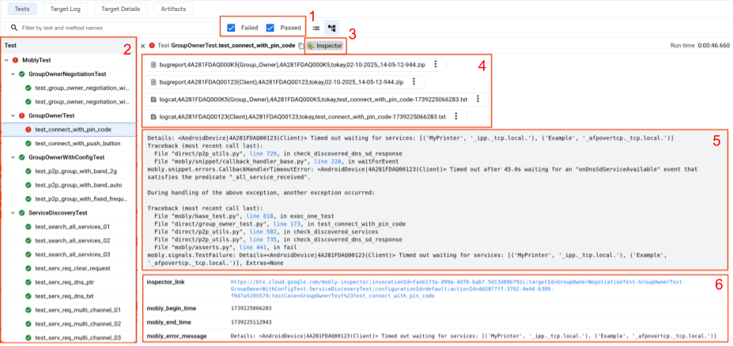
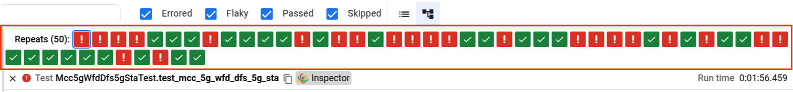
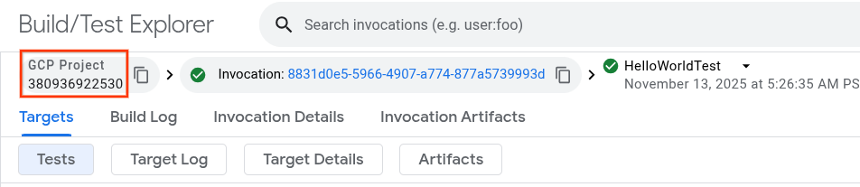
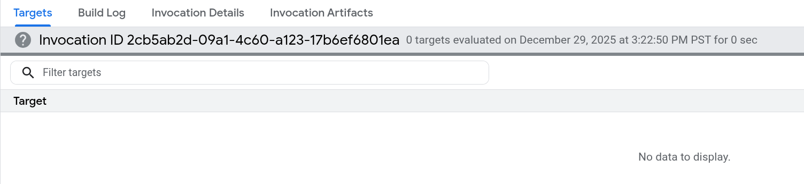

# Mobly Android Partner Tools

This is a suite of command-line tools used for Android partner testing based
on the [Mobly framework](https://github.com/google/mobly).

Use cases include the [BeToCQ test suite](https://github.com/android/betocq).

## Requirements

* Python 3.11 or above

## Installation instructions

**If you have already installed a test suite that includes these tools, such as
BeToCQ, you may skip this step.**

Open a new terminal and run the following installation commands.

```bash
# on Linux

python3 -m venv venv
source venv/bin/activate
python3 -m pip install mobly-android-partner-tools
```
```cmd
:: on Windows

python -m venv venv
venv\Scripts\activate
python -m pip install mobly-android-partner-tools
```

## Mobly test runner

The Mobly test runner is a tool that serves as the entry point for executing a
given Mobly test or suite. It is designed with a focus on simplicity and 
flexibility. 

The runner analyzes the contents of a Mobly test package, performs test 
environment setup/teardown, and executes the test.

As a basic usage example:

```bash
mobly_runner my_test_suite
```

executes the installed Mobly test suite `my_test_suite`.

For more details, please refer to the CLI options in `mobly_runner -h`.

## Results uploader

The Results Uploader is a tool for generating shareable UI links for automated
test results.

It uploads test-generated files to Google Cloud Storage, and presents the
results in an organized way on a dedicated web UI (Resultstore/BTX). The result 
URL can then be shared to anyone who is given access (including both Google and 
non-Google accounts), allowing for easy tracking and debugging.

### First-time setup

To start using the Results Uploader, you need to be able to access the shared
Google Cloud Storage bucket:

1. Confirm/request access to the shared GCP project with your Google contact.
   The Googler will give you a project name to use.
2. Install the gcloud CLI from https://cloud.google.com/sdk/docs/install
    * If installation fails with the above method, try the alternative linked
      [here](https://cloud.google.com/sdk/docs/downloads-versioned-archives#installation_instructions).
3. Download and execute [this script](src/results_uploader/gcloud_setup.py) to
   log into the GCP project, and set up local credentials.

### How to upload results

1. At the end of a completed test run, you'll see the final lines on the console
   output as follows. Record the folder path in the line starting with
   "Artifacts are saved in".

    ```
    Total time elapsed 961.7551812920001s
    Artifacts are saved in "/tmp/logs/mobly/Local5GTestbed/10-23-2023_10-30-50-685"
    Test summary saved in "/tmp/logs/mobly/Local5GTestbed/10-23-2023_10-30-50-685/test_summary.yaml"
    Test results: Error 0, Executed 1, Failed 0, Passed 1, Requested 0, Skipped 0
    ```

2. Run the uploader command, setting the `artifacts_folder` as the path recorded
   in the previous step.
    ```bash
    results_uploader <artifacts_folder>
    ```

3. If successful, at the end of the upload process you will get a link beginning
   with http://btx.cloud.google.com. 
   You may [view your results](#view-your-results-in-btx) and share this link to others who wish to
   view your test results.
   * If you do not see a link, consult the [Troubleshooting](#troubleshooting)
     section.

#### Automatically upload results upon test completion

To automatically upload results upon test completion, use the
[`mobly_runner`](#mobly-test-runner) to execute your tests, and 
add the following command-line option:

```bash
mobly_runner my_test_suite --upload_results
```

**Note:** You must have completed the uploader 
[First-time setup](#first-time-setup) prior to using this option, or the upload 
will automatically be aborted.

### Batch uploading
If you run
```bash
results_uploader <folder_containing_multiple_mobly_artifacts>
```

The tool automatically searches recursively for all Mobly artifact folders
contained within this directory, and creates a single BTX link with a sub-entry
for each folder.

You may use this feature to quickly share a set of related Mobly runs.

### View your results in BTX

When you open a BTX link, you should see the following dashboard.



1. Use this checkbox to show/hide test cases based on status (e.g. Failed,
   Passed, Skipped).
2. A list of test cases along with their results:
   Green (passed), Red (failed), Grey (skipped). Click on the test case name to
   display the details for that test.
   * For repeated test cases, the test case may also appear as Orange, which
     indicates that it failed some but not all iterations (flaky). You may check
     each individual iteration from the Repeats bar.
     
3. Click to open the Mobly Inspector debugging UI. See more details below.
4. A list of test artifacts (log files, bugreports, videos) recorded from the
   test case. Click to view/download the file contents.
5. The test failure stacktrace, if the test failed.
6. The test properties. You may find custom metadata or test metrics in this
   section.

See [Troubleshooting](#troubleshooting) if you do not see the above elements.

When you open the Inspector page for a given test case, you will see a 
time-synchronized view of the logs and/or screen captured on each device,
depending on the test. This is a helpful tool to easily track events that occur
across devices.

* Click on the Play button at the top to start playback.
* Click on any point in the timeline, or any log message, and all windows will
  be synced to that timestamp.
* You may enable text, log level, and tag filters at the top of each log window.


To view the history of all test results you uploaded on BTX, click on the 
"GCP Project" at the top left of the page. If no results appear, click inside the
search bar and press Enter.



### Troubleshooting

If you see a warning indicating **"There is test suite information that is not 
visible in this view. Switch to Tree View to see test suites,"** you may switch
to the correct Tree View by clicking on the indicated button.


If you do not get a link at all after upload, or instead of the dashboard, you 
see "No data to display." with a grey banner as shown below:



1. Check the debug logs of the uploader. Its location is shown at the beginning
   of the tool's output indicated by `Debug logs are saved to: ...`.
2. Report this issue to Google and attach all tool output, including the debug
   logs.

### Additional reference

To see a list of supported options, please consult `results_uploader --help`.
